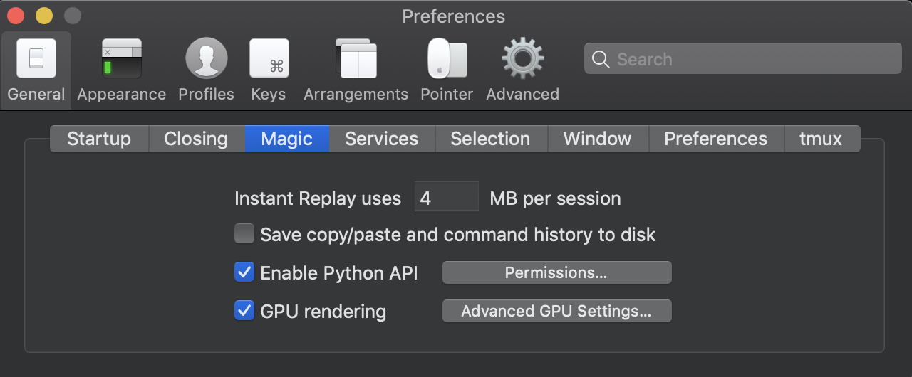
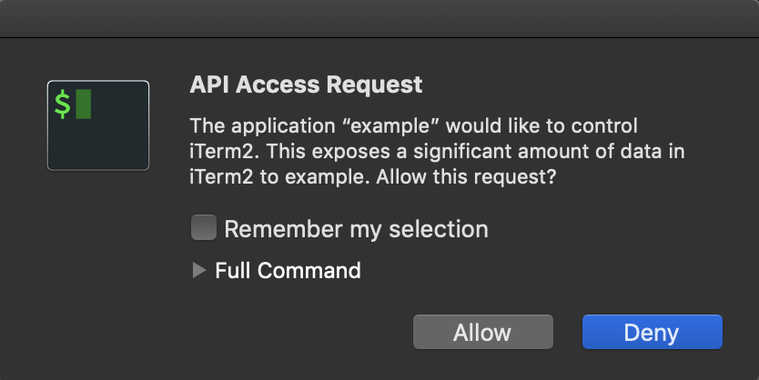

# Golang implementation of iterm2 python's remote API

[](http://godoc.org/github.com/tjamet/goterm2)

# Notice

The code is in early stage and the repository currently doesn't offer all features provided by the [python reference implementation](https://github.com/gnachman/iTerm2/tree/master/api/library/python/iterm2)

The provided primitives are currently low level

# Usage

To list all current iterm sessions, copy the following lines

```
package main

import (
	"fmt"
	"os"

	log "github.com/sirupsen/logrus"
	iterm2 "github.com/tjamet/goterm2"
	"github.com/tjamet/goterm2/api"
)

func main() {
	logger := log.New()
	logger.SetOutput(os.Stdout)
	logger.SetLevel(log.TraceLevel)
	i, err := iterm2.New()
	if err != nil {
		fmt.Println(err)
		os.Exit(1)
	}
	i.Logger(logger)
	fmt.Println(i.ListSessions(&api.ListSessionsRequest{}))
}
```

This library requires your iterm to be configured to run the `Python API` in the menus: `iTerm2` > `Preferences` > `general` > `magic`
as shown below



You will then need to accept the connection as shown below

